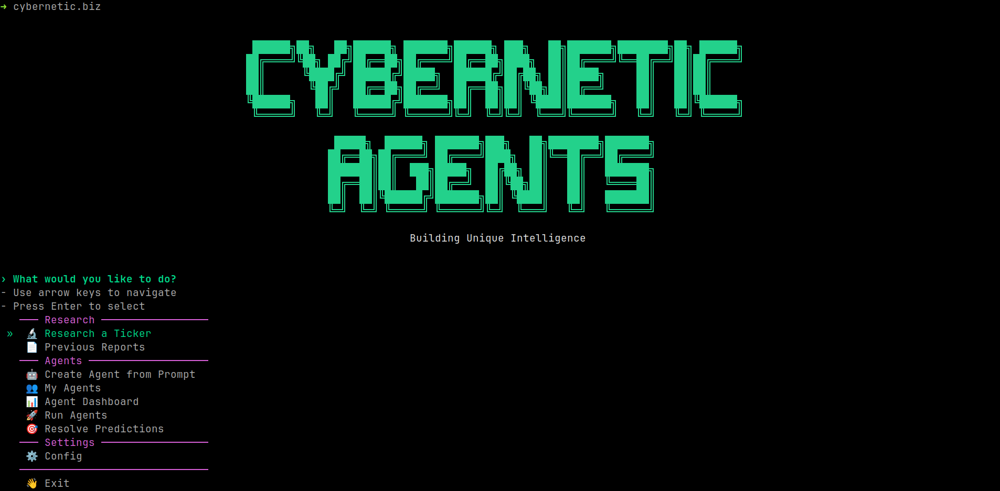
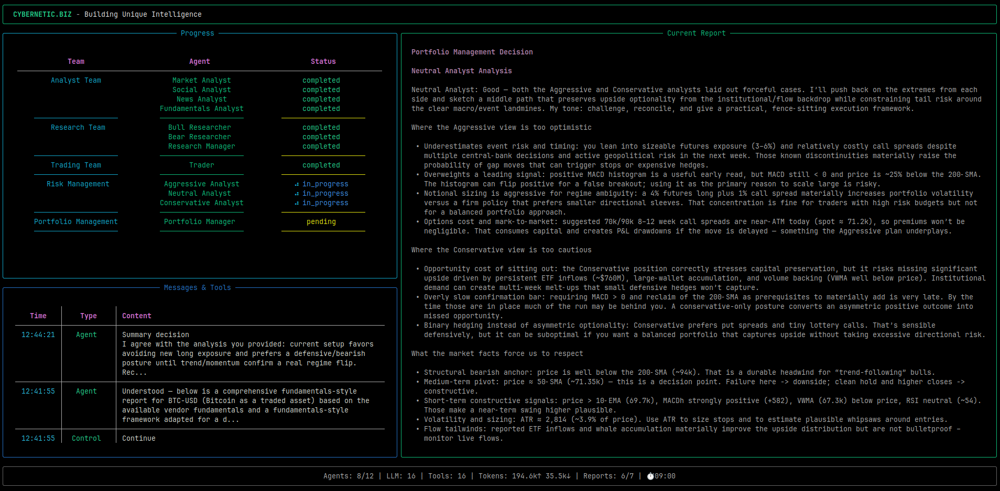
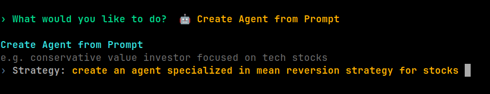
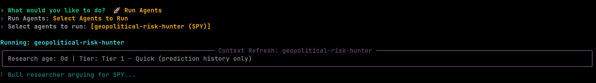

<p align="center">
  
</p>

<p align="center">
  <a href="https://cybernetic.biz"></a>
  <a href="https://x.com/cybernetic_biz"></a>
  <a href="https://github.com/CYBERNETIC-BIZ/CyberneticAgents"></a>
</p>

# CyberneticAgents

**Self-Regulating Systems and Feedback Loops**

A terminal-based multi-agent research system that conducts collaborative stock research using LLM-powered analysts, researchers, risk managers, and traders — then generates autonomous trading agents that make predictions, track performance, and improve over time.

> **IMPORTANT DISCLAIMER:** CyberneticAgents is **research software for educational and experimental purposes only**. It is **not** a financial advisor, broker, or investment platform. All predictions, analysis, and trading signals generated by this software are **simulated research outputs** and do **not** constitute financial advice, investment recommendations, or solicitations to buy or sell any securities. **Trading and investing involve substantial risk of loss, including the potential for total loss of capital.** Past performance of any agent or prediction does not guarantee future results. You should **never** make real financial decisions based solely on the output of this software. Always consult a qualified financial professional before making investment decisions. The authors, contributors, and maintainers of this software accept **no responsibility or liability** for any financial losses, damages, or other consequences resulting from the use of this software or reliance on its outputs.

Built with [LangGraph](https://github.com/langchain-ai/langgraph) for orchestration, [Rich](https://github.com/Textualize/rich) for terminal UI, and support for 6 LLM providers.

---

## Features

- **Multi-Agent Research Pipeline** — 12 specialized agents collaborate through analysis, debate, and risk assessment across 4 phases
- **6 LLM Providers** — OpenAI, Anthropic, Google Gemini, xAI Grok, OpenRouter, and Ollama (local)
- **Autonomous Persona Agents** — Generate persistent trading agents from research or natural language prompts, each with unique personas and track records
- **Tiered Context Refresh** — Automatic staleness detection enriches agents with fresh news, sentiment, and prediction history on repeat runs
- **Lightweight Debate System** — 2nd+ agent runs use a Bull vs Bear vs Judge debate (3 LLM calls) instead of a single prediction call
- **Rich Terminal UI** — Interactive menus, live dashboard, formatted reports, animated banner, and two color themes
- **Dual Data Vendors** — yfinance (default) and Alpha Vantage with per-category vendor routing
- **Paper Trading & Tracking** — SQLite-backed predictions with automatic resolution, P&L calculation, and portfolio management
- **CyberneticAgents Integration** — Push predictions to [cybernetic.biz](https://cybernetic.biz) with auto-registration
- **Self-Update** — Run `cybernetic.biz update` to pull the latest version from GitHub

---

## Quick Start

### Prerequisites

- Python 3.10+
- At least one LLM provider API key (OpenAI, Anthropic, Google, xAI, or OpenRouter)

### Installation

```bash
git clone https://github.com/CYBERNETIC-BIZ/CyberneticAgents.git
cd CyberneticAgents
./install.sh
```

The install script checks your Python version, sets up a virtual environment, installs all dependencies, symlinks `cybernetic.biz` to `~/.local/bin`, and launches the app. On first launch, the CLI detects that no API keys are configured and guides you through setup. You need at least one LLM provider key to use research and agent features.

> **Note:** If `~/.local/bin` is not on your `PATH`, add it:
> ```bash
> echo 'export PATH="$HOME/.local/bin:$PATH"' >> ~/.bashrc && source ~/.bashrc
> ```

### Running

After installation, run from anywhere:

```bash
cybernetic.biz
```

You can also configure keys and theme anytime from the app's config menu.

### What You'll See

1. **Animated ASCII banner** with matrix decode effect
2. **Interactive main menu** with keyboard navigation
3. **First-run setup** prompting you to configure an API key

From the main menu you can:
- **Research a Ticker** — Run a full multi-agent analysis
- **Create Agent from Prompt** — Describe a strategy in plain English
- **My Agents** — View, edit, run, and resolve your agents
- **Agent Dashboard** — See all agents with accuracy and P&L
- **Run Agents** — Batch-run all or selected agents
- **Resolve Predictions** — Settle pending predictions against current prices
- **Config** — Set API keys and switch color themes

### Update

```bash
cybernetic.biz update
```

---

## How It Works

The system has two main modes: **Research** (deep multi-agent analysis of a ticker) and **Agent Running** (autonomous predictions by generated agents). Research produces the knowledge; agents act on it repeatedly.

### Research Pipeline (Full Analysis)

When you research a ticker, 12 agents collaborate across 4 phases:

```
┌─────────────────────────────────────────────────────────────────┐
│                     PHASE 1: ANALYSIS                           │
│  ┌──────────┐ ┌──────────────┐ ┌──────────┐ ┌──────────────┐   │
│  │  Market   │ │Fundamentals  │ │   News   │ │ Social Media │   │
│  │ Analyst   │ │  Analyst     │ │ Analyst  │ │   Analyst    │   │
│  └─────┬────┘ └──────┬───────┘ └────┬─────┘ └──────┬───────┘   │
│        └──────────────┼──────────────┼──────────────┘           │
│                       ▼                                         │
│              ┌─────────────────┐                                │
│              │ Analysis Reports│                                │
│              └────────┬────────┘                                │
├───────────────────────┼─────────────────────────────────────────┤
│                 PHASE 2: RESEARCH                               │
│        ┌──────────────┼──────────────┐                          │
│        ▼                             ▼                          │
│  ┌────────────┐              ┌────────────┐                     │
│  │    Bull     │◄────────────►│    Bear    │                     │
│  │ Researcher  │   Debate    │ Researcher │                     │
│  └──────┬─────┘              └─────┬──────┘                     │
│         └────────────┬─────────────┘                            │
│                      ▼                                          │
│             ┌─────────────────┐                                 │
│             │Research Manager │──► Investment Plan               │
│             └────────┬────────┘                                 │
├──────────────────────┼──────────────────────────────────────────┤
│               PHASE 3: TRADING                                  │
│                      ▼                                          │
│              ┌──────────────┐                                   │
│              │    Trader    │──► Trading Strategy                │
│              └──────┬───────┘                                   │
├─────────────────────┼───────────────────────────────────────────┤
│            PHASE 4: RISK ANALYSIS                               │
│     ┌───────────────┼───────────────┐                           │
│     ▼               ▼               ▼                           │
│ ┌──────────┐ ┌────────────┐ ┌──────────────┐                   │
│ │Aggressive│ │  Neutral   │ │Conservative  │                   │
│ │ Debator  │ │  Debator   │ │  Debator     │                   │
│ └────┬─────┘ └─────┬──────┘ └──────┬───────┘                   │
│      └─────────────┬───────────────┘                            │
│                    ▼                                            │
│            ┌──────────────┐                                     │
│            │ Risk Manager │──► Final Trade Decision              │
│            └──────────────┘                                     │
└─────────────────────────────────────────────────────────────────┘
```

<p align="center">
  
</p>

**Phase 1 — Analysis:** Up to 4 analyst agents independently gather data using specialized tools (price data, indicators, fundamentals, news, sentiment). Each produces a detailed report.

**Phase 2 — Research:** A Bull Researcher and Bear Researcher debate the investment case over configurable rounds, drawing on all analysis reports and BM25-matched memories from past situations. A Research Manager judges the debate and produces an investment plan.

**Phase 3 — Trading:** A Trader agent takes the investment plan and formulates a concrete trading strategy with entry/exit points and position sizing.

**Phase 4 — Risk Analysis:** Three risk debators (aggressive, neutral, conservative) argue the risk profile. A Risk Manager synthesizes their debate into a final BUY/SELL/HOLD decision.

The result is saved as a report and can be used to generate a persistent trading agent.

### Agent Creation

Agents can be created two ways:

1. **From Research** — After a full analysis, the system generates an agent with the research baked into its persona. The agent carries the full analysis context, system prompts, and tool configuration derived from the research.

2. **From Prompt** — Describe a trading strategy in natural language (e.g., "momentum trader focused on tech stocks with 3-day targets"). An LLM generates the agent configuration, system prompts, and personality.

<p align="center">
  
</p>

Each agent gets:
- A unique persona (stored as JSON) with personality traits and direction bias
- Custom analysis and comment system prompts
- Tool configuration (which analyst types informed its creation)
- A $10,000 starting paper portfolio
- A research date timestamp for staleness tracking

### Agent Prediction Runs

When an agent runs, the behavior differs based on whether it's the first or a subsequent run:

#### First Run (Single LLM Call)

```
run_agent_once()
  ├─ Fetch 30-day market data (yfinance)
  ├─ Send market context + system prompt to LLM
  ├─ Parse JSON response (direction, confidence, reasoning)
  ├─ Create Prediction record
  ├─ Execute paper trade (100% of portfolio for single-ticker agents)
  └─ Push to cybernetic.biz (optional)
```

#### 2nd+ Runs (Tiered Refresh + Lightweight Debate)

<p align="center">
  
</p>

On repeat runs, the system detects that baked-in research may be stale and enriches the context:

```
run_agent_once()
  ├─ Fetch 30-day market data (yfinance)
  ├─ Classify staleness tier
  ├─ Build prediction history (last 5 resolved predictions)
  ├─ [Tier 2+] Fetch news headlines + LLM sentiment summary
  ├─ [Tier 3] Display stale research warning
  ├─ Display tier notification panel
  ├─ Run lightweight debate (replaces single LLM call)
  │    ├─ Bull Researcher (1 LLM call)
  │    ├─ Bear Researcher (1 LLM call)
  │    └─ Research Manager / Judge (1 LLM call)
  ├─ Parse debate result → direction, confidence, reasoning
  ├─ Create Prediction record
  ├─ Execute paper trade (100% of portfolio for single-ticker agents)
  └─ Push to cybernetic.biz (optional)
```

### Tiered Context Refresh

The staleness system classifies how old the agent's research is and decides what fresh context to inject:

| Tier | Condition | Context Added |
|------|-----------|---------------|
| **Tier 1 — Quick** | Research < threshold | Prediction history only |
| **Tier 2 — Lightweight** | Research moderately stale | + Recent news headlines + LLM sentiment summary |
| **Tier 3 — Full Restale** | Research very stale | + Stale warning (falls through to Tier 2 behavior) |

Staleness thresholds adapt to the agent's tool types:

| Agent Focus | Tier 2 Threshold | Tier 3 Threshold |
|-------------|-----------------|-----------------|
| News/social heavy | 2 days | 7 days |
| Fundamentals heavy | 7 days | 30 days |
| Mixed/default | 3 days | 14 days |

### Lightweight Debate

On 2nd+ runs, instead of a single LLM call, the system runs a 3-agent debate reusing the same Bull/Bear/Judge factory functions from the full research pipeline:

1. **Bull Researcher** — Builds a bullish case using market data, news, prediction history, and original research
2. **Bear Researcher** — Builds a bearish counter-case using the same inputs
3. **Research Manager (Judge)** — Evaluates both arguments and makes a BUY/SELL/HOLD decision

If the debate fails, the system falls back to a single LLM call with all enriched context.

### Prediction Resolution

Predictions are automatically resolved when their target date passes:

1. Fetch current price for the ticker
2. Compare against entry price and predicted direction
3. Mark as CORRECT or INCORRECT
4. Execute paper SELL trade at current price
5. Update agent portfolio balance with realized P&L

---

## CLI Commands

| Command | Description |
|---------|-------------|
| `cybernetic.biz` | Interactive menu |
| `cybernetic.biz analyze` | Research a ticker with multi-agent analysis |
| `cybernetic.biz run <agent_id>` | Run a single agent prediction |
| `cybernetic.biz run-all` | Run all agents for predictions |
| `cybernetic.biz resolve` | Resolve pending predictions against current prices |
| `cybernetic.biz dashboard` | Show the agent dashboard |
| `cybernetic.biz agents` | List all agents |
| `cybernetic.biz agent <agent_id>` | Detailed view of a specific agent |
| `cybernetic.biz schedule <agent_id>` | Print a cron line for scheduling (`--daily HH:MM`) |
| `cybernetic.biz config` | Configure API keys and color theme |
| `cybernetic.biz update` | Update to the latest version from GitHub |
| `cybernetic.biz reports` | Browse and export previous analysis reports |

---

## Agent Types

### Analysts (Phase 1)
| Agent | Role | Tools |
|-------|------|-------|
| Market Analyst | Technical analysis: price data, moving averages, MACD, RSI, Bollinger Bands | `get_stock_data`, `get_indicators` |
| Fundamentals Analyst | Financial statements, balance sheet, cash flow, earnings | `get_fundamentals`, `get_balance_sheet`, `get_cashflow`, `get_income_statement` |
| News Analyst | News sentiment, insider transactions, macro trends | `get_news`, `get_global_news` |
| Social Media Analyst | Public sentiment from social media discussion | `get_news` (sentiment mode) |

### Researchers (Phase 2)
| Agent | Role |
|-------|------|
| Bull Researcher | Advocates for investment with growth and opportunity focus; uses BM25 memory |
| Bear Researcher | Argues risks and downside scenarios; debates with Bull over multiple rounds |
| Research Manager | Judges the bull/bear debate, produces a decisive investment plan |

### Risk Management (Phase 4)
| Agent | Role |
|-------|------|
| Aggressive Debator | Emphasizes high-reward opportunities, argues for larger positions |
| Neutral Debator | Provides balanced risk/reward perspective |
| Conservative Debator | Risk-mitigation focus, argues for caution |
| Risk Manager | Synthesizes risk debate into final BUY/SELL/HOLD decision |

### Trader (Phase 3)
| Agent | Role |
|-------|------|
| Trader | Formulates concrete trading strategy with entry/exit points and position sizing |

---

## Supported LLM Providers

| Provider | Models | API Key |
|----------|--------|---------|
| OpenAI | GPT-5.2, GPT-5-mini, GPT-5-nano, GPT-4.1 | `OPENAI_API_KEY` |
| Anthropic | Claude Sonnet 4.5, Claude Opus 4.5, Claude Haiku 4.5 | `ANTHROPIC_API_KEY` |
| Google | Gemini 3 Pro/Flash, Gemini 2.5 Flash | `GOOGLE_API_KEY` |
| xAI | Grok 4.1, Grok 4 | `XAI_API_KEY` |
| OpenRouter | Any model via OpenRouter | `OPENROUTER_API_KEY` |
| Ollama | Auto-detected local models (auto-starts server) | — |

Switch providers through the interactive menu when researching a ticker or creating an agent.

---

## Color Themes

Two built-in themes, switchable via **Config > Theme**:

| Theme | Best For | Description |
|-------|----------|-------------|
| **Deep Space** (default) | VSCode terminal, modern terminals | True-color hex palette matching VSCode Dark+ |
| **Neon Pulse** | Standalone terminal emulators (GNOME, iTerm2, Alacritty) | Vivid ANSI colors |

Theme preference is saved to `~/.cybernetic/preferences.json` and persists across sessions.

---

## Project Structure

```
CyberneticAgents/
├── cybernetic/
│   ├── cli/                    # Typer CLI + Rich terminal UI
│   │   ├── app.py              # Entry point, commands, interactive menu
│   │   ├── research_flow.py    # Multi-agent research UI with live dashboard
│   │   ├── create_flow.py      # Create agents from natural language prompts
│   │   ├── config_flow.py      # API key + theme configuration
│   │   ├── dashboard.py        # Agent dashboard with stats
│   │   ├── my_agents.py        # Browse, edit, run, resolve agents
│   │   ├── reports.py          # Browse and export analysis reports
│   │   ├── theme.py            # Color theme system (Deep Space / Neon Pulse)
│   │   ├── stats_handler.py    # LLM call tracking during research
│   │   ├── models.py           # CLI enums (AnalystType)
│   │   └── utils.py            # Questionary helpers, analyst/LLM selection
│   ├── research/
│   │   ├── agents/             # All 12 agent implementations
│   │   │   ├── analysts/       # Market, fundamentals, news, social
│   │   │   ├── researchers/    # Bull & bear researchers
│   │   │   ├── risk_mgmt/     # Aggressive, neutral, conservative debators
│   │   │   ├── managers/       # Research & risk managers
│   │   │   ├── trader/         # Trading strategy agent
│   │   │   └── utils/          # Agent states, tools, BM25 memory
│   │   └── graph/              # LangGraph workflow orchestration
│   │       ├── trading_graph.py  # Main graph class
│   │       ├── setup.py          # Node initialization
│   │       ├── signal_processing.py
│   │       ├── reflection.py     # Historical learning
│   │       ├── conditional_logic.py
│   │       └── propagation.py    # State updates
│   ├── agents/                 # Persona agent system
│   │   ├── generator.py        # Create agents from research or prompts
│   │   ├── runner.py           # Run predictions (single call or debate)
│   │   ├── resolver.py         # Resolve prediction outcomes
│   │   ├── staleness.py        # Research staleness classification
│   │   ├── news_context.py     # News fetching + sentiment summary
│   │   ├── debate.py           # Lightweight 3-agent debate orchestrator
│   │   ├── think.py            # LLM-powered agent config generation
│   │   ├── names.py            # Agent name generation
│   │   └── ticker.py           # Ticker alias resolution + validation
│   ├── llm/                    # Multi-provider LLM factory
│   │   ├── factory.py          # Lazy provider routing
│   │   ├── openai_client.py    # OpenAI / Ollama / OpenRouter / xAI
│   │   ├── anthropic_client.py
│   │   └── google_client.py
│   ├── data/                   # Market data layer
│   │   ├── interface.py        # Vendor routing (per-category + per-tool)
│   │   ├── y_finance.py        # yfinance: prices, indicators, fundamentals
│   │   ├── yfinance_news.py    # yfinance: news data
│   │   └── alpha_vantage*.py   # Alpha Vantage implementation
│   ├── storage/                # SQLite persistence
│   │   ├── db.py               # Database operations (CRUD + stats)
│   │   └── models.py           # Agent, Prediction, Trade dataclasses
│   └── config.py               # Configuration management
├── docs/
│   └── ascii-text-art.txt      # ASCII banner art
├── .env.example                # Template for API keys
├── requirements.txt
├── pyproject.toml
└── .gitignore
```

---

## Storage

All data is stored locally:

- **Database:** `~/.cybernetic/cybernetic.db` (SQLite, created automatically on first run)
- **Preferences:** `~/.cybernetic/preferences.json` (theme selection)
- **Research results:** `./results/` (override with `CYBERNETIC_RESULTS_DIR` env var)
- **Reports:** `./reports/` (PDF exports from analysis reports)

SQLite is part of Python's standard library — no additional database setup required.

---

## Configuration

### API Keys

Configure through the interactive menu (**Config > API Keys**) or copy `.env.example` to `.env` and fill in your keys:

```bash
cp .env.example .env
# Edit .env with your API keys
```

### LLM Settings

Configure the global LLM provider and models via **Config > LLM Settings** in the interactive menu. These settings are used for all agent runs. Defaults in `cybernetic/config.py`:

```python
"llm_provider": "openai",
"deep_think_llm": "gpt-5.2",      # Complex reasoning (full research)
"quick_think_llm": "gpt-5-mini",  # Fast tasks (agent predictions)
```

### Debate Rounds

```python
"max_debate_rounds": 1,            # Bull vs bear debate iterations
"max_risk_discuss_rounds": 1,      # Risk discussion iterations
```

### Data Vendors

```python
"data_vendors": {
    "core_stock_apis": "yfinance",        # yfinance | alpha_vantage
    "technical_indicators": "yfinance",
    "fundamental_data": "yfinance",
    "news_data": "yfinance",
}
```

---

## Open Source & Commercial Relationship

**CyberneticAgents CLI** is an open source tool licensed under Apache 2.0. It integrates with [cybernetic.biz](https://cybernetic.biz), which is a **separate, privately owned commercial platform**.

Please note:

- **The CLI and the commercial platform are separate.** This CLI is open source software. The cybernetic.biz website, API, brand, domain, infrastructure, data, products, services, and any revenue derived from them are privately owned and operated.
- **Contributions to this repository do not grant any rights, ownership, equity, or stake in cybernetic.biz or any associated commercial products, services, APIs, data, or revenue.**
- **The CLI references these platforms** for features like prediction pushing, agent registration, and commenting. This is a client-to-service integration — contributors are building the open source client, not the commercial service.
- **Forking or redistributing** the CLI under Apache 2.0 is permitted, but use of the "cybernetic.biz" or "CyberneticAgents" names, brands, logos, or trademarks in a way that implies affiliation with or endorsement by the commercial platform is not authorized.
- **The commercial platforms may use, display, or incorporate data** sent from this CLI (predictions, comments, agent registrations) as part of their services without obligation to contributors.

By contributing to this repository, you acknowledge and agree that:
1. Your contributions are to the open source CLI tool only.
2. You have no claim to the commercial platforms, their products, services, APIs, data, or revenue.
3. The maintainer reserves the right to use contributions in both the open source CLI and any commercial integrations.

See [CONTRIBUTING.md](CONTRIBUTING.md) for full contributor guidelines.

---

## Disclaimer

**THIS SOFTWARE IS PROVIDED FOR RESEARCH AND EDUCATIONAL PURPOSES ONLY.**

CyberneticAgents is an experimental research tool. None of the predictions, analyses, trading signals, or outputs generated by this software constitute financial advice, investment recommendations, or any form of solicitation to buy, sell, or hold any financial instrument. All portfolio balances and trades within the software are **simulated (paper trading)** and have no connection to real financial markets or brokerage accounts.

**RISK WARNING:** Trading and investing in financial markets carry a high level of risk, including the risk of **total loss of your invested capital**. You should not invest money you cannot afford to lose. Never make real financial decisions based on the output of this or any automated software. The maintainers, contributors, and authors of CyberneticAgents are **not responsible for any financial losses, damages, or consequences** arising from the use of this software or any reliance on its outputs.

By using this software, you acknowledge that you understand these risks and agree that all use is at your own risk.

## License

Licensed under the Apache License, Version 2.0. See [LICENSE](LICENSE) for details.

## Acknowledgments

**CyberneticAgents** is built upon [TradingAgents](https://github.com/TauricResearch/TradingAgents) by [Tauric Research](https://github.com/TauricResearch), licensed under Apache 2.0. Designed to run AI-powered trading research agents on the [cybernetic.biz](https://cybernetic.biz) platform.
